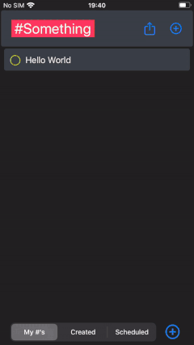
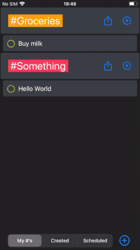
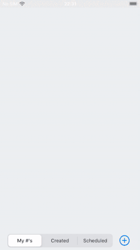
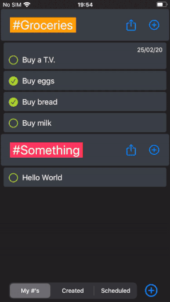
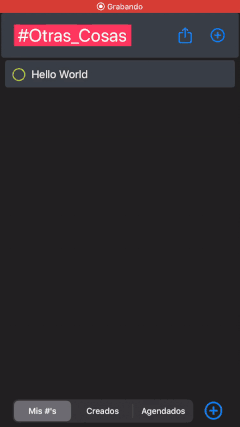
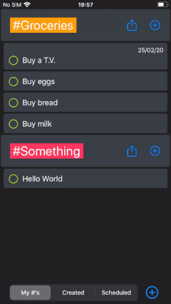

# #Todo  

*#Todo* is a simple reimplementation of a clasic todo list, but with some features to make it intuitive and easy to use. It was born from the idea of creating a replacement for the confusing and unintuitive todo lists already available on the Apple App Store.

#Todo was designed to work on the latest versions of iOS, iPadOS and MacOS:
+ iOS 13.3.1 📱
+ iPadOS 13.3.1 
+ MacOS 10.15.2 💻

## Tags ＃
With #Todo you can use Tags to separate and organize your todos. While you are writting your todo description, at any time, you can use the *＃* symbol to begin the tag and ending it by typing a *space*.
Each tag will be given a color, for better and easier organization.

## iCloud Syncronization ☁️
#Todo uses the power of [iCloud](https://developer.apple.com/icloud/) to instantly and securely syncronize the user information between their Apple ecosystem.

## Dark Mode 🔲
Using the latest technologies available in iOS 13 and MacOS 10.15, the aplication can show a different interface for [light and dark mode](https://developer.apple.com/design/human-interface-guidelines/ios/visual-design/dark-mode/).

## Simplified Sharing 📲
One of the key features of #Todo is the simplicity of sharing your todos with other people, just tap the share icon located to the right of every tag division and a text containing all the todos related to that tag will be generated.

Then you can just copy and paste or send it to the application of yout choice. 

## iPad Split View and Side Over
Use #Todo as you want! 🙌🏻

#Todo supports all the orientations and sizes an application can take on iPadOS

## Localization 🌎
#Todo is localized to work perfectly on english and spanish.

## Taptic Feedback 📳
#Todo uses the Taptic Engine available on every iPhone since the iPhone 7 to give the user an inmersive expericence by providing specific vibrations for the different actions in the app.

## Tap to complete, swipe to delete ✅
#Todo was designed with the idea to be as simple as possible. To complete a todo just tap on it and to delete it just swipe it from the right.

